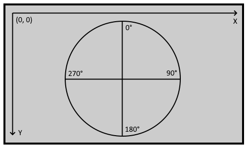

# T5UIC1
## 1 Overview
The T5UIC1 is a UART based screen based on the DWIN T5 CPU. The T5UIC1 only has a single T5 CPU core and uses a unique reduced instruction set. It is best suited for low-cost applications that do not require a touchscreen or complex UI functions.

**Display features:**
* 65k color TFT display (RGB565)
* Basic drawing commands (rectangle, lines, dots)
* Chinese and ASCII text display as well as the ability to display formatted numeric variables
* JPEG icon and image decoding and display
* EAN-13 barcode generation and QR code generation
* 384kb storage for fonts
    * 6x12 to 32x64 dot matrix ASCII characters and 12x12 to 64x64 dot matrix GB2312 character library
* 512kb storage for images and icons. (Divided into 16 banks of 32kb. Single image cannot exceed 32kb)
    * Divided into 16 banks of 32kb.
    * Can store 16 JPEG images, not exceeding 32kb each.
    * Can store up to 16 JPEG icon library files. (A single library file can occupy multiple banks)
* 32kb of SRAM, for user specified data.
    * Can be read and written to during runtime. Initialized to `0` on boot.
    * Useful for uploading new pictures during runtime.
* 16kb flash memory, for user specified data.
    * Can be read and written to during runtime. Contents persist between reboots.
    * 100,000 write cycles.
    * Useful for persistent configuration options.
* MicroSD/SDHC slot for firmware, fonts & image updates.
* An additional full-duplex serial port that can be controlled through UART.
    * Useful for daisy chaining peripherals to the display on processors with a single UART line.
* Adjustable CPU clock (240MHz and 400MHz)

---

## 2 UART instruction set
The device has a configurable baud-rate. The baud-rate is configured through the SD card config file `T5UIC1.CFG`.

The serial port is always in **8N1** mode.

### 2.1 Color format
All colors are in the 16 bit **RGB565** format.
**16 Bits:**
| 15 | 14 | 13 | 12 | 11 | 10 | 9  | 8  | 7  | 6  | 5  | 4  | 3  | 2  | 1  | 0  |
|----|----|----|----|----|----|----|----|----|----|----|----|----|----|----|----|
| R4 | R3 | R2 | R1 | R0 | G5 | G4 | G3 | G2 | G1 | G0 | B4 | B3 | B2 | B1 | B0 |

### 2.2 Coordinate system
Coordinate system is controlled by the rotation parameter in the SD card config file `T5UIC1.CFG`

### 2.3 Serial data frame
A single data frame to the display consists of a frame header, instruction, data, CRC (optional) and footer.

The data frame is as such:
| Header | Instruction        | Data                    | CRC (optional) | Footer              |
|--------|--------------------|-------------------------|----------------|---------------------|
| `0xAA`   | 1 byte instruction | Up to 248 bytes of data | 2 byte CRC-16/MODBUS | `0xCC 0x33 0xC3 0x3C` |

### 2.4 CRC
CRC can be enabled in the SD card config file `T5UIC1.CFG`. The CRC is a CRC-16/MODBUS.

If any instruction fails the CRC check the device will the following error:

| Instruction | Data |
|-------------|------|
| `0xFF`      | `0x01`|

All device responses will also generate their own CRC.

### 2.4 Instruction set
Below are all the instructions and their corresponding parameters. Every instruction follow the format described in **Serial Data Frame**. If an instruction has an expected response it is **explicitly listed**. All instructions without an expected response described, do not have any response.

---

#### `0x00` - Handshake
Check if the device is online. If it is online it will respond to this command.

**Transmit:**
| Instruction | Data (0 bytes) |
|-------------|------|
| `0x00`      | NONE |

**Expected response:**
| Instruction | Data (2 bytes) |
|-------------|------|
| `0x00`      | `0x4F 0x4B` - "OK"|

---

#### `0x30` - Backlight brightness
Set device backlight brightness.

**Transmit:**
| Instruction | Data (1 byte) |
|-------------|------|
| `0x30`      | [1B] **BRIGHTNESS** |

**BRIGHTNESS:** 1 byte

\- `0x00` to `0xFF` -  The brightness value. A value of `0x00` turn's the backlight off.

---

#### `0x31` - Write data to memory
Write user data to the 32KB of SRAM or 16KB Flash memory.

**Transmit:**
| Instruction | Data (4 to 248 bytes) |
|-------------|------|
| `0x31`      |[1B] **MEM_TYPE**; [2B] **ADDRESS**; [nB] **DATA**|

**Expected response (FOR FLASH WRITE ONLY. No response for SRAM):**
| Instruction | Data (3 bytes) |
|-------------|------|
| `0x31`      |`0xA5 0x4F 0x4B` - "¥OK"|

**MEM_TYPE:** 1 byte.

\- `0x5A` for the 32KB of SRAM. 

\- `0xA5` for the 16KB of Flash.

**ADDRESS:** 2 bytes.
\- `0x0000` to `0x7FFF` for the 32KB of SRAM.

\- `0x0000` to `0x3FFF` for the 16KB of Flash.

Writing outside of these ranges can lead to corruption!

**DATA:** n bytes (up to a maximum of 245)

\- The data to be written to that offset.

---

#### `0x32` - Read data from memory
Read user data from the 32KB of SRAM or 16KB Flash memory.

**Transmit:**
| Instruction | Data (4 bytes) |
|-------------|------|
| `0x32`      |[1B] **MEM_TYPE**; [2B] **ADDRESS**; [1B] **LENGTH**|

**Expected response:**
| Instruction | Data (5 to 248 bytes) |
|-------------|------|
| `0x32`      |[1B] **MEM_TYPE**; [2B] **ADDRESS**; [1B] **LENGTH**; [nB] **DATA**|

**MEM_TYPE:** 1 byte.

\- `0x5A` for the 32KB of SRAM. 

\- `0xA5` for the 16KB of Flash.

**ADDRESS:** 2 bytes.

\- `0x0000` to `0x7FFF` for the 32KB of SRAM.

\- `0x0000` to `0x3FFF` for the 16KB of Flash.

Reading outside of these ranges can lead to corruption!

**LENGTH:** 1 byte.

\- `0x01` to `0xF0` - Amount of bytes to read.

Reading lengths outside of this range is unsupported!

**DATA:** n bytes (up to a maximum of 240)

\- The data to be read from that offset.

---

#### `0x33` - Save image from SRAM to persistent image memory bank
Save the data currently in the 32KB of SRAM to a specified persistent image memory bank. Used to, for example, modify an icon or background image persistently during runtime.

**To successfully use this command an image must be written to SRAM with index `0x000` first!**

**Transmit:**
| Instruction | Data (3 bytes) |
|-------------|------|
| `0x33`      |[2B] `0x5A 0xA5`; [1B] **MEMORY_BANK** |

**Expected Response:**
| Instruction | Data (3 bytes) |
|-------------|------|
| `0x33`      |`0x4F 0x4B` - "OK"|

**MEMORY_BANK:** 1 byte.

\- `0x00` to `0x0F` - The 32KB memory bank.

Writing to memory banks outside of this range is unsupported and can lead to corruption!

---

#### `0x34` - Change display rotation
Changes the display rotation immediately. This affects drawing command origin and rotation. This setting is **not** persistent.

**Transmit:**
| Instruction | Data (3 bytes) |
|-------------|------|
| `0x34`      |[2B] `0x5A 0xA5`; [1B] **ROTATION** |

**Expected Response:**
| Instruction | Data (2 bytes) |
|-------------|------|
| `0x34`      |`0x4F 0x4B` - "OK"|

**ROTATION:** 1 byte.

\- `0x00` - 0 degrees

\- `0x01` - 90 degrees

\- `0x02` - 180 degrees

\- `0x03` - 270 degrees

---

#### `0x38` - Set additional serial port baud-rate
Sets the baud rate on the additional (secondary) serial port.

**Transmit:**
| Instruction | Data (2 bytes) |
|-------------|------|
| `0x38`      |[2B] **BAUD_RATE** |

**BAUD_RATE:** 2 bytes

\- `0x0001` to `0x03FF` - Baud-rate. Values correspond to `15667200 / desired baud-rate`. Lowest baud-rate is 15300.

---

#### `0x39` - Transmit data over additional serial port
Transmits data over the additional (secondary) serial port.

**Transmit:**
| Instruction | Data (1 to 248 bytes) |
|-------------|------|
| `0x39`      |[nB] **DATA** |

**DATA:** n bytes (up to maximum of 248)

\- The data to transmit over the serial port

---

#### `0x3A` - Receive data from the additional serial port
Receives data from the additional (secondary) serial port.

The serial port automatically sends this instruction upon received serial data.

**THERE IS NO TRANSMISSION REQUIRED FOR THIS INSTRUCTION. IT IS RECEIVE ONLY**

**Expected response:**
| Instruction | Data (2 to 248 bytes) |
|-------------|------|
| `0x3A`      |[1B] **LENGTH**; [nB] **DATA** |

**LENGTH:** 1 byte

\- `0x01` to `0xF0` - Amount of bytes recieved.

**DATA:** n bytes (up to a maximum of 240)

\- The bytes received from the serial port.

---